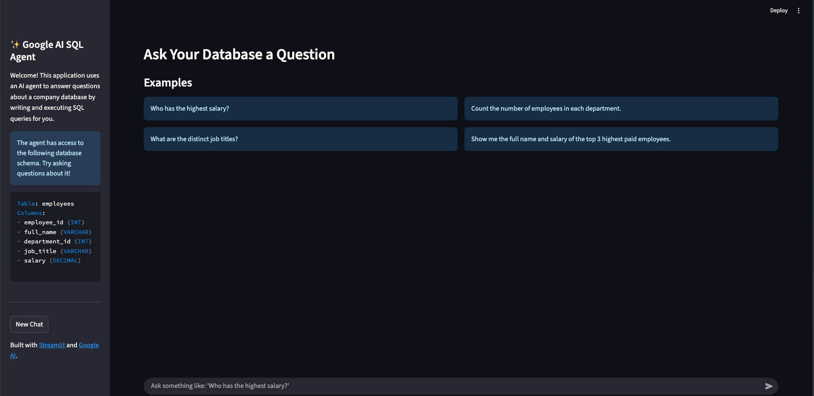
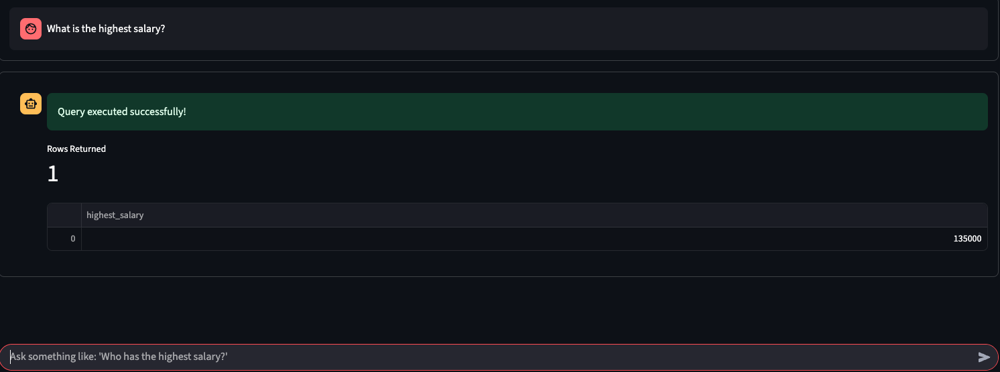

# Google AI SQL Agent

A conversational AI agent that can answer questions about your database by writing and executing SQL queries automatically. Built with Streamlit, Google AI (Gemini), and AutoGen.

## 🚀 Features

- **Natural Language to SQL**: Ask questions in plain English and get SQL results
- **Real-time Database Queries**: Direct connection to PostgreSQL database
- **Interactive Chat Interface**: Clean, modern UI built with Streamlit
- **AI-Powered Code Generation**: Uses Google Gemini to generate Python scripts
- **Automatic Query Execution**: No manual SQL writing required
- **Caching**: Optimized performance with result caching

## 📸 Project Screenshots

### Application Interface


The main interface shows a clean chat-based UI where users can ask questions about the database in natural language. The sidebar displays the database schema and provides navigation options.

### Query Results


Example of how the agent processes a question and returns formatted results with metrics showing the number of rows returned.

## 🏗️ Architecture

This project uses a multi-agent system:

1. **UserProxyAgent (Code_Executor)**: Executes the generated Python scripts
2. **ConversableAgent (Python_SQL_Writer)**: Generates Python code using Google Gemini
3. **Streamlit Frontend**: Provides the user interface

## 📊 Database Schema

The application works with a PostgreSQL database containing:

```sql
Table: employees
Columns: 
- employee_id (INT)
- full_name (VARCHAR)
- department_id (INT)
- job_title (VARCHAR)
- salary (DECIMAL)
```

## 🛠️ Setup Instructions

### Prerequisites

- Python 3.8+
- PostgreSQL database
- Google AI API key

### Installation

1. **Clone the repository**
   ```bash
   git clone <repository-url>
   cd my_ai_agent_project
   ```

2. **Create and activate virtual environment**
   ```bash
   python -m venv .venv
   source .venv/bin/activate  # On Windows: .venv\Scripts\activate
   ```

3. **Install dependencies**
   ```bash
   pip install -r requirements.txt
   ```

4. **Set up environment variables**
   Create a `.env` file with:
   ```
   GEMINI_API_KEY=your_google_ai_api_key
   DB_HOST=localhost
   DB_PORT=5432
   DB_NAME=your_database_name
   DB_USER=your_username
   DB_PASSWORD=your_password
   ```

5. **Set up the database**
   ```bash
   # Run the SQL script to create tables and load data
   psql -U your_username -d your_database_name -f employee.sql
   ```

6. **Run the application**
   ```bash
   streamlit run app.py
   ```

## 💬 Usage Examples

Once the application is running, you can ask questions like:

- "Who has the highest salary?"
- "What are the distinct job titles?"
- "Count the number of employees in each department"
- "Show me the full name and salary of the top 3 highest paid employees"

## 🔧 How It Works

1. **User Input**: User asks a question in natural language
2. **AI Processing**: Google Gemini generates a Python script to query the database
3. **Code Execution**: The generated script is executed against the PostgreSQL database
4. **Result Formatting**: Results are formatted as JSON and displayed in the UI
5. **Caching**: Results are cached for better performance

## 📁 Project Structure

```
my_ai_agent_project/
├── app.py                 # Streamlit web application
├── agent_logic.py         # AI agent implementation
├── employee.sql           # Database schema and sample data
├── employees.csv          # Sample employee data
├── requirements.txt       # Python dependencies
├── Interface.png          # Application interface screenshot
├── ResultQuery.png        # Query results screenshot
└── coding/               # Directory for generated code execution
```

## 🛡️ Security Features

- Database credentials are stored in environment variables
- Generated code is executed in a controlled environment
- No direct SQL injection vulnerabilities due to parameterized queries

## 🚀 Performance Optimizations

- **Caching**: Query results are cached to avoid repeated executions
- **Connection Pooling**: Efficient database connection management
- **Async Processing**: Non-blocking UI during query execution

## 🤝 Contributing

1. Fork the repository
2. Create a feature branch
3. Make your changes
4. Add tests if applicable
5. Submit a pull request

## 📝 License

This project is licensed under the MIT License.

## 🙏 Acknowledgments

- Built with [Streamlit](https://streamlit.io/)
- Powered by [Google AI](https://ai.google/)
- Uses [AutoGen](https://github.com/microsoft/autogen) for multi-agent conversations
- Database connectivity with [psycopg2](https://www.psycopg.org/)

---

**Note**: Make sure to replace placeholder values (API keys, database credentials) with your actual configuration before running the application. 